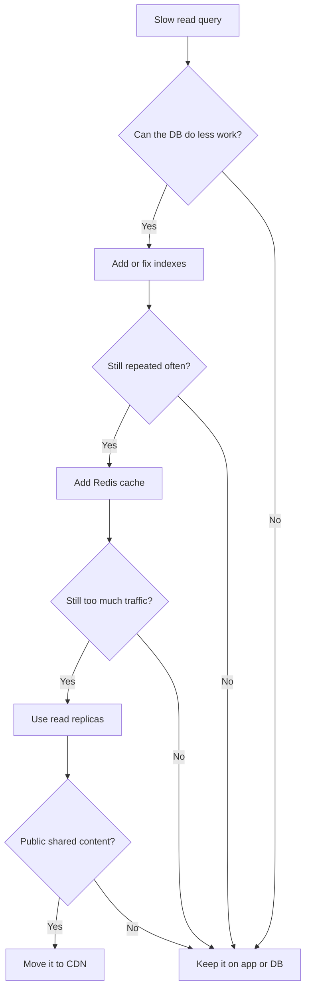

When interviewers ask about scaling reads, the mistake is to jump straight to replicas or sharding. The better answer is a progression: first make the database cheaper to read, then add horizontal read capacity, then cache the hot path, and only then move to the edge or split the data.

Think of it as a ladder. You climb only when the lower step is no longer enough.

## The mental model

Read traffic usually grows faster than write traffic. That means the first question is not "How do I add more infrastructure?" It is "How do I make each read cheaper?"

The usual order is:

1. Add the right indexes
2. Denormalize or precompute expensive joins
3. Add app-level caching
4. Use read replicas
5. Push public content to a CDN
6. Shard only when the dataset or traffic forces you to

That order matters because each step increases complexity. If you skip directly to sharding, you make the system harder to operate before you’ve fixed the simpler bottlenecks.

## One example to keep in mind

Imagine an `orders` table with 500 million rows and one very common screen:

```sql
SELECT id, status, amount, created_at
FROM orders
WHERE user_id = 123
ORDER BY created_at DESC
LIMIT 20;
```

This is a perfect read-scaling example because the same request is repeated all the time:

- the user opens the order history again
- support agents check the same account repeatedly
- the UI reloads the same list after a refresh

If that query is slow, the temptation is to say, "Let’s add read replicas."

That is usually the wrong first move.



### Step 1: Make the query cheap first

Start with an index that matches the access pattern:

```sql
CREATE INDEX idx_orders_user_created
ON orders(user_id, created_at DESC)
INCLUDE(status, amount);
```

Now the database can find the right rows quickly, in the right order, and often avoid extra heap reads.

Why this matters:

- `user_id` is the filter
- `created_at DESC` matches the sort order
- `INCLUDE(status, amount)` helps the query stay index-only when possible

This is often the highest-ROI change in the whole stack.

### Step 2: Avoid repeating the same work

If the same user opens the same screen repeatedly, add Redis:

```python
def get_recent_orders(user_id):
    key = f"recent_orders:{user_id}"
    cached = redis.get(key)
    if cached:
        return cached

    rows = db.fetch(
        """
        SELECT id, status, amount, created_at
        FROM orders
        WHERE user_id = ?
        ORDER BY created_at DESC
        LIMIT 20
        """,
        user_id,
    )
    redis.setex(key, 60, rows)
    return rows
```

Now repeated reads become cheap cache hits instead of repeated database work.

The point is not just performance. It is also load reduction. Every cache hit is one less query, one less planner run, and one less chance to burn the database on a hot path.

### Step 3: Spread load with read replicas

If the traffic is still climbing, replicas let you spread read load:

```text
Writes → Primary
Reads  → Replica 1
Reads  → Replica 2
Reads  → Replica 3
```

Use replicas when:

- the query is already efficient
- the same query is still being hit too often
- you can tolerate a little replication lag

The big caution is read-after-write consistency. If a user writes something and immediately refreshes, a lagging replica might not show the new data yet. A common fix is to route that user’s reads to the primary for a short window after the write.

### Step 4: Move public content to the edge

If the data is public and global, a CDN can serve it closer to the user. That is perfect for product pages, blog posts, images, and other shared content.

It is not for:

- private data
- user-specific dashboards
- real-time collaborative state

The rule is simple: if many users read the same thing, the edge helps. If the response is personalized, the edge is usually the wrong place.

### Step 5: Shard only as a last resort

Sharding is what you do when one well-tuned database still cannot handle the working set. It is powerful, but it adds routing, rebalancing, and operational complexity.

That means sharding is usually the answer to a size problem, not a query problem.

## The decision flow

If I had to turn the whole topic into a flow, it would look like this:

```text
Is the query slow?
  ↓
Can the database do less work?
  → Add or fix indexes
  → Rewrite the query
  → Denormalize or precompute
  ↓
Are the same reads happening again and again?
  → Add Redis cache
  ↓
Is the data still too hot?
  → Add read replicas
  ↓
Is the content public and globally shared?
  → Add CDN / edge caching
  ↓
Is one database still too large?
  → Shard as the last resort
```

That is the story interviewers want to hear. It shows you understand the order of operations, not just the tools.

## What usually wins in practice

For most teams, the biggest gains come from this order:

1. Better indexes
2. Better query shape
3. Redis
4. Denormalization or materialized views
5. Read replicas
6. CDN for public data
7. Sharding only if the data size forces it

The key insight is that read scaling is not just about adding more servers. It is also about reducing how much work each read has to do.

## Final interview answer

If I had to answer in one minute, I would say:

> Start by making the read cheap with the right indexes and query shape. Then cache repeated reads, use read replicas to spread traffic, and move public content to a CDN. Only shard when the database is still too large or too hot after those steps.

That answer is simple, ordered, and easy to defend. It shows that you understand the trade-offs instead of reaching for the most complex tool first.
